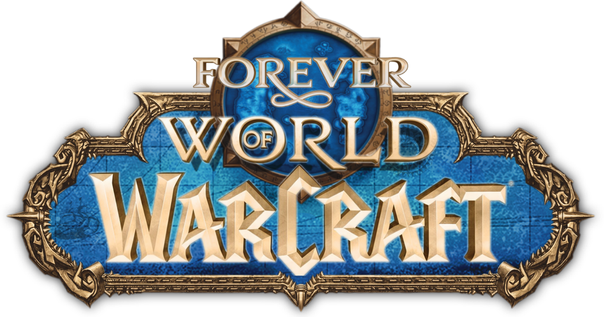

<div align="center">
  <a href="https://doruksayn.github.io/FATEFORGE/">
    
  </a>

  <h1>FATEFORGE</h1>
  <p><strong>Two tools. A thousand possible adventures.</strong></p>
  <p>Roll a character or forge a name for your next WoW Forever adventure.</p>

  <a href="https://doruksayn.github.io/FATEFORGE/">FATEFORGE</a>
  &nbsp;·&nbsp;
  <a href="https://github.com/doruksayn/FATEFORGE">View source</a>

  <br />

  <a href="https://github.com/doruksayn/FATEFORGE/actions/workflows/deploy.yml"></a>
  
  
</div>

## Choose your path

| Tool | What it does | Open directly |
|---|---|---|
| **Character Randomizer** | Roll a compatible faction, race, class, gender, and name. | [`#/character`](https://doruksayn.github.io/FATEFORGE/#/character) |
| **Name Generator** | Choose a character context and generate or reroll a name. | [`#/names`](https://doruksayn.github.io/FATEFORGE/#/names) |

Both tools use the same Faction, Race, and Class compatibility data. Their recent histories are independent and saved separately in your browser.

## Features

### ⚔️ Character Randomizer

- Choose fixed or random Faction, Race, Class, and Gender options.
- Follow the roulette as it reveals a valid character.
- Reroll the first name, surname, or full name while keeping the character.
- Browse, restore, remove, and page through the latest 20 rolls.

### ✨ Name Generator

- Generate names for a selected or randomized character context.
- Race and Class choices stay within valid WoW Forever combinations.
- Reroll either name part or the full name without changing the context.
- Browse, restore, remove, and page through Recent Names.

### Class-Influenced Surnames

Enable **Class-Influenced Surnames** in either tool to give surnames a class flavor. With the option on, 35% of surname rolls draw from the selected Race/Class pool; the other 65% use that Race’s general pool. First names continue to use Race and Gender.

| Pool | Entries |
|---|---:|
| First names (Race + Gender) | 480 |
| Race surnames | 240 |
| Class-influenced surnames | 336 |
| **Total** | **1,056** |

Browse every current name in **[NAME_POOLS.md](./NAME_POOLS.md)**.

## Run locally

Requires Node.js and npm.

```bash
npm install
npm run dev
```

| Command | Purpose |
|---|---|
| `npm test` | Run the logic and storage tests |
| `npm run lint` | Check the code with Oxlint |
| `npm run build` | Type-check and create a production build |
| `npm run preview` | Preview the production build locally |

## How it works

- **Navigation:** `#/character` and `#/names`; browser Back/Forward and refresh preserve the selected tool.
- **Compatibility:** shared race/class/faction rules in `src/data/compatibility.ts`.
- **Names:** local pools and name generation; no backend, AI calls, or external naming service.
- **History:** Character Randomizer uses `wow-forever-roulette.history.v1`; Name Generator uses `wow-forever-name-generator.history.v1`.

## Project map

| Path | Contents |
|---|---|
| `src/data/` | Compatibility rules and name pools |
| `src/logic/` | Randomizer, navigation, and name-generation logic |
| `src/components/` | Name Generator, history, icons, and shared controls |
| `src/storage/` | Validated, separate browser history storage |
| `public/` | WoW Forever branding, class icons, and background art |

## Deployment

The `main` branch deploys to [GitHub Pages](https://doruksayn.github.io/FATEFORGE/) through [GitHub Actions](https://github.com/doruksayn/FATEFORGE/actions/workflows/deploy.yml). For a fresh setup, choose **Settings → Pages → Build and deployment → GitHub Actions** as the publishing source.

## Disclaimer

FATEFORGE is an unofficial fan project. World of Warcraft and related assets are property of Blizzard Entertainment. FATEFORGE is not affiliated with, sponsored by, or endorsed by Blizzard Entertainment.
